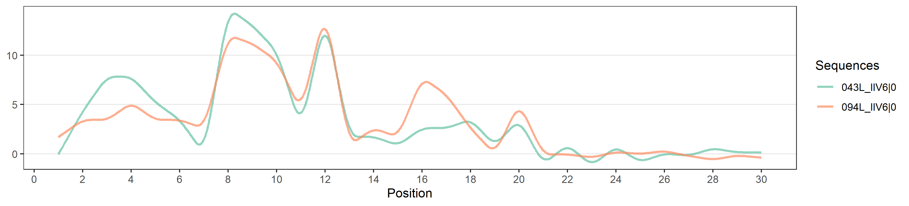
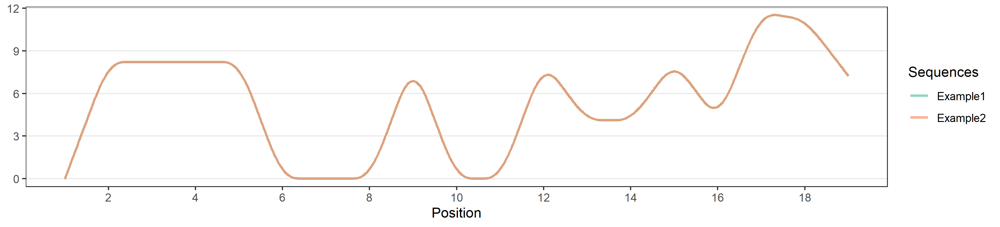

<!-- README.md is generated from README.Rmd. Please edit that file -->

# UltraPseR: Wappers for UltraPse in R

An R package for biological sequence representations

-   [UltraPse](https://github.com/pufengdu/UltraPse) by
    [pudengdu](https://github.com/pufengdu)

## Install development vertion

~~!!!NOTE: We have tested these codes on Ubuntu 18.04.2 LTS. There is no
guarantee that these codes can be compiled and executed on other
platforms without modifications.(Currently cannot be installed in the
**Win**)~~ Now, `UltraPseR` support all platforms.

The development version from github:

``` r
if (!requireNamespace("devtools", quietly=TRUE))
    install.packages("devtools")
devtools::install_github("YuLab-SMU/UltraPseR")
```

## Quick Example

### Calculated Component

``` r
library(dplyr)
```

``` r
tiny_sequences <- system.file("extdata", "tiny.fas", package = "UltraPseR")
x <- UltraPseR::UpseR(input = tiny_sequences, module = "comp", note = "stdprot") 
```

    ## Registered S3 methods overwritten by 'ggalt':
    ##   method                  from   
    ##   grid.draw.absoluteGrob  ggplot2
    ##   grobHeight.absoluteGrob ggplot2
    ##   grobWidth.absoluteGrob  ggplot2
    ##   grobX.absoluteGrob      ggplot2
    ##   grobY.absoluteGrob      ggplot2

``` r
x
```

    ##    043L_IIV6|0 094L_IIV6|0
    ## 1        0.000       1.695
    ## 2        4.310       3.390
    ## 3        7.759       3.390
    ## 4        7.759       5.085
    ## 5        5.172       3.390
    ## 6        3.448       3.390
    ## 7        0.000       2.542
    ## 8       14.655      11.864
    ## 9       12.931      11.017
    ## 10      10.345       9.322
    ## 11       2.586       4.237
    ## 12      13.793      14.407
    ## 13       1.724       0.847
    ## 14       1.724       2.542
    ## 15       0.862       1.695
    ## 16       2.586       7.627
    ## 17       2.586       5.932
    ## 18       3.448       2.542
    ## 19       0.862       0.000
    ## 20       3.448       5.085

### Pse-Protein

``` r
tiny_sequences <- system.file("extdata", "tiny.fas", package = "UltraPseR")
pro <- UltraPseR::UpseR(input = tiny_sequences, note = "stdprot", module = "pse", property = "ZIMJ680105", w = 0.05, l = 10, t = 2)
p <- UltraPseR::plot_upse(pro)
p
```

<!-- -->

### Pse-DiDNA

``` r
DNA_sequences <- system.file("extdata", "tiny-dna.fas", package = "UltraPseR")
dna_res <-UltraPseR::UpseR(input = DNA_sequences, note = "didna", module = "pse", property = "DD0033", w = 0.05, l = 3, t = 1)
p1 <- UltraPseR::plot_upse(dna_res)
p1
```

<!-- -->

### Explore proprety

``` r
UltraPseR::available_prop(note = "didna")
```

    ## DD0001   Base stacking
    ## DD0002   Protein induced deformability
    ## DD0003   B-DNA twist
    ## DD0004   Dinucleotide GC Content
    ## DD0005   A-philicity
    ## DD0006   Propeller twist
    ## DD0007   Duplex stability (freeenergy)
    ## DD0008   Duplex stability (disruptenergy)
    ## DD0009   DNA denaturation
    ## DD0010   Bending stiffness
    ## DD0011   Protein DNA twist
    ## DD0012   Stabilising energy of Z-DNA
    ## DD0013   Aida_BA_transition
    ## DD0014   Breslauer_dG
    ## DD0015   Breslauer_dH
    ## DD0016   Breslauer_dS
    ## DD0017   Electron_interaction
    ## DD0018   Hartman_trans_free_energy
    ## DD0019   Helix-Coil_transition
    ## DD0020   Ivanov_BA_transition
    ## DD0021   Lisser_BZ_transition
    ## DD0022   Polar_interaction
    ## DD0023   SantaLucia_dG
    ## DD0024   SantaLucia_dH
    ## DD0025   SantaLucia_dS
    ## DD0026   Sarai_flexibility
    ## DD0027   Stability
    ## DD0028   Stacking_energy
    ## DD0029   Sugimoto_dG
    ## DD0030   Sugimoto_dH
    ## DD0031   Sugimoto_dS
    ## DD0032   Watson-Crick_interaction
    ## DD0033   Twist
    ## DD0034   Tilt
    ## DD0035   Roll
    ## DD0036   Shift
    ## DD0037   Slide
    ## DD0038   Rise
    ## DD0039   Stacking energy
    ## DD0040   Bend
    ## DD0041   Tip
    ## DD0042   Inclination
    ## DD0043   Major Groove Width
    ## DD0044   Major Groove Depth
    ## DD0045   Major Groove Size
    ## DD0046   Major Groove Distance
    ## DD0047   Minor Groove Width
    ## DD0048   Minor Groove Depth
    ## DD0049   Minor Groove Size
    ## DD0050   Minor Groove Distance
    ## DD0051   PersistanceLength
    ## DD0052   MeltingTemperature
    ## DD0053   Mobilitytobendtowardsmajorgroove
    ## DD0054   Mobilitytobendtowardsminorgroove
    ## DD0055   PropellerTwist
    ## DD0056   ClashStrength
    ## DD0057   Enthalpy
    ## DD0058   Shift(RNA)
    ## DD0059   Hydrophilicity(RNA)
    ## DD0060   Freeenergy
    ## DD0061   Twist_twist
    ## DD0062   Tilt_tilt
    ## DD0063   Roll_roll
    ## DD0064   Twist_tilt
    ## DD0065   Twist_roll
    ## DD0066   Tilt_roll
    ## DD0067   Shift_shift
    ## DD0068   Slide_slide
    ## DD0069   Rise_rise
    ## DD0070   Shift_slide
    ## DD0071   Shift_rise
    ## DD0072   Slide_rise
    ## DD0073   Twist_shift
    ## DD0074   Twist_slide
    ## DD0075   Twist_rise
    ## DD0076   Tilt_shift
    ## DD0077   Tilt_slide
    ## DD0078   Tilt_rise
    ## DD0079   Roll_shift
    ## DD0080   Roll_slide
    ## DD0081   Roll_rise
    ## DD0082   Slidestiffness
    ## DD0083   Shiftstiffness
    ## DD0084   Rollstiffness
    ## DD0085   Risestiffness
    ## DD0086   Tiltstiffness
    ## DD0087   Twiststiffness
    ## DD0088   Wedge
    ## DD0089   Direction
    ## DD0090   Flexibility_slide
    ## DD0091   Flexibility_shift
    ## DD0092   Entropy
    ## Total number of properties : 92
